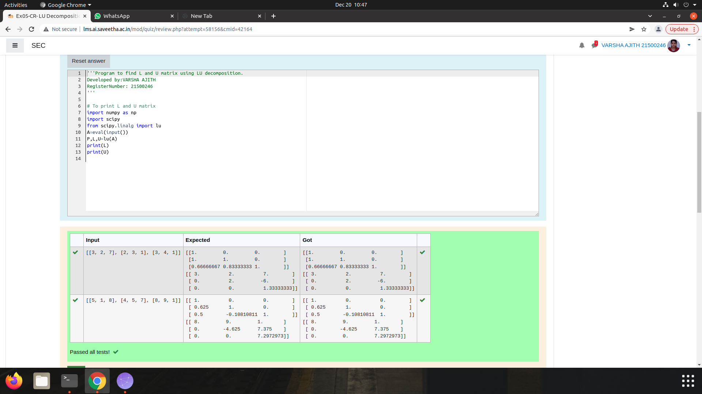

# LU Decomposition without zero on the diagonal

## AIM:
To write a program to find the LU Decomposition of a matrix.

## Equipments Required:
1. Hardware – PCs
2. Anaconda – Python 3.7 Installation / Moodle-Code Runner

## Algorithm
1. Import numpy as np.
2. From scipy import lu.
3. Get the input from user.
4. End the program
## Program:
```
/*
```Program to find the LU Decomposition of a matrix.
Developed by: Varsha Ajith
RegisterNumber: 21500246
``
import numpy as np
import scipy
from scipy.linalg import lu
A=eval(input())
P,L,U=lu(A)
print(L)
print(U)


```Program to solve a matrix using LU decomposition.
Developed by: Varsha Ajith
RegisterNumber: 21500246
``
import numpy as np
from scipy.linalg import lu_factor, lu_solve
A = eval(input())
b = eval(input())
lu, piv = lu_factor(A)

x = lu_solve((lu, piv), b)
print (x)
```
## Output:



## Result:
Thus the program to find the LU Decomposition of a matrix is written and verified using python programming.

